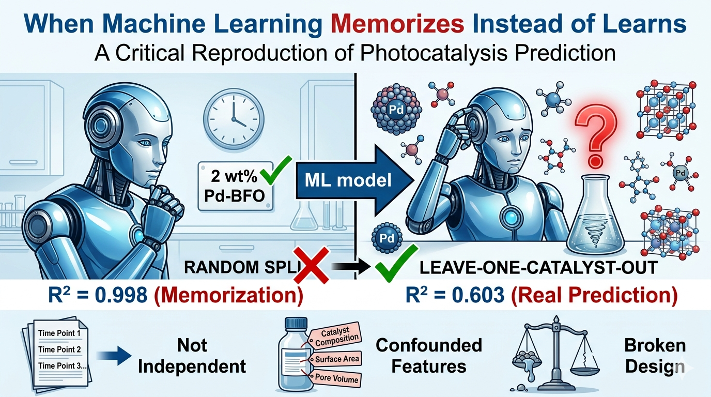
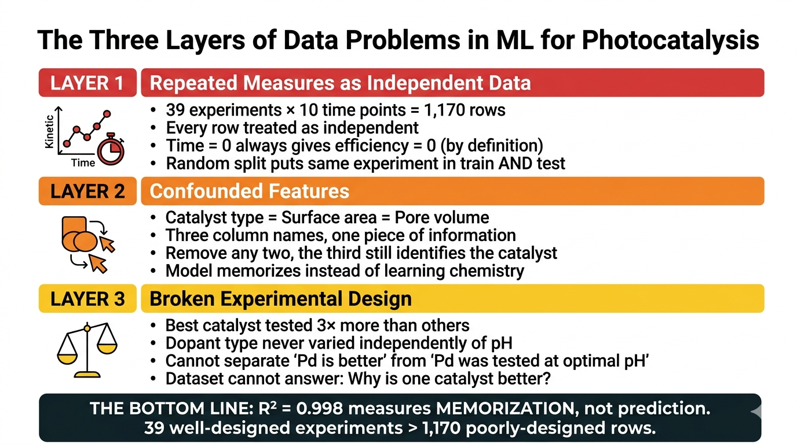
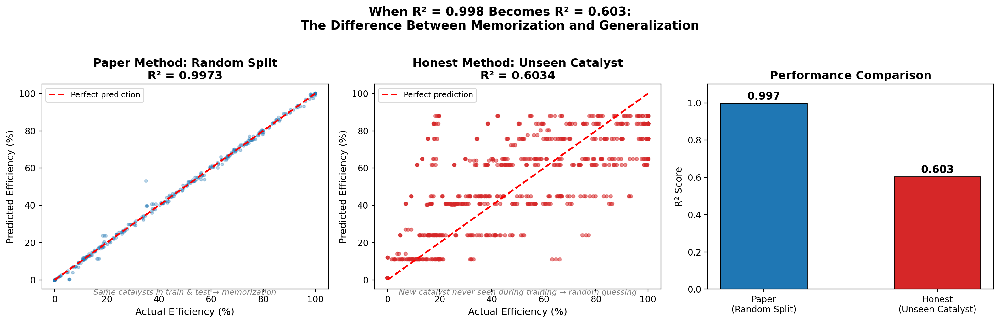
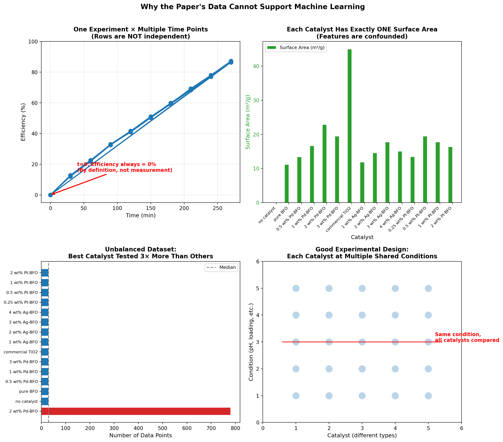
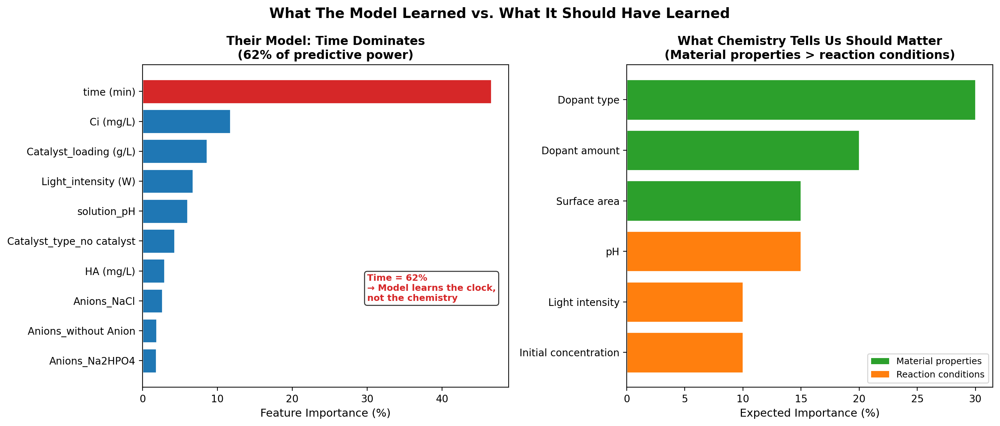
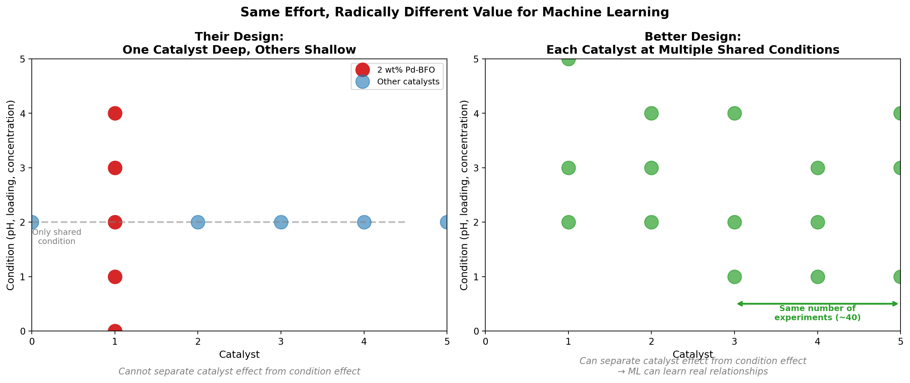

# When R² = 0.998 Means Nothing

### A critical reproduction of ML for photocatalysis prediction



**TL;DR:** A Q1 journal published a machine learning model with R² = 0.998 for predicting photocatalytic degradation. I reproduced it and found the real R² for unseen catalysts is ~0.60. The model didn't learn chemistry — it memorized catalyst names. The root cause was experimental design, not the ML algorithm.

---

## The Big Picture



---

## The Paper's Claim

Jaffari et al. (Journal of Hazardous Materials, 2023) trained a CatBoost model on 1,200 data points with 10 features to predict malachite green dye degradation efficiency. They reported:

- **R² = 0.998** on test data
- Time was the most important feature (62.6%)
- "ML can predict photocatalytic performance"

I reproduced their model exactly and got the same numbers. Then I asked a question they never asked: *Can this model predict a catalyst it has never seen?*

---

## Reproducing Their Results

I successfully reproduced their CatBoost model with the same hyperparameters (random_state=313, 70/30 split):

**My reproduction: R² = 0.9974** (paper claimed 0.998)



The left panel shows near-perfect predictions. But look at the middle panel — when tested on a catalyst completely withheld from training (2 wt% Pd-BFO), the model collapses to R² = 0.60.

The 0.998 wasn't predicting photocatalysis. It was recognizing catalysts it had already seen.

---

## The Three Hidden Problems



### Problem 1: Repeated Measures Treated as Independent

The "1,200 data points" are really **39 experiments × 10 time points × 3 replicates**. Time points from the same beaker are correlated, not independent. At t=0, efficiency is always 0% — by mathematical definition, not measurement. Random splitting puts later time points in the test set while earlier ones remain in training. The model just interpolates.

### Problem 2: Confounded Features

Every catalyst has exactly one surface area and one pore volume. These three features — catalyst type, surface area, and pore volume — are three labels for the same thing. Remove any two, and the third still perfectly identifies the catalyst. The model learned "Surface area = 22.9 → that means Pd-BFO → predict high efficiency."

### Problem 3: Broken Experimental Design

The best catalyst (2 wt% Pd-BFO) was tested under dozens of conditions. Most other catalysts were tested under just one. You cannot separate "Pd is the best dopant" from "Pd was tested at the optimal pH" because dopant type and reaction conditions were never varied independently.

---

## What the Model Actually Learned



The model's feature importance shows **time at 62%**, with everything else collectively under 38%. A model that actually understood photocatalysis would weight material properties (dopant type, surface area) above reaction conditions. Instead, it learned the clock.

---

## How to Fix It: Same Experiments, Different Design



With the same ~40 experiments, a proper experimental design could have produced ML-ready data:

- Test every catalyst at a shared baseline condition → fair comparison
- Vary pH and loading independently for multiple catalysts → separate material effects from condition effects
- Plan validation before experiments → leave-one-catalyst-out becomes possible

---

## Key Numbers

| Metric | Value |
|--------|-------|
| Paper's claimed R² | 0.998 |
| My reproduced R² (their method) | 0.9974 |
| True generalization R² (unseen catalyst) | 0.603 |
| R² inflation | 0.394 |
| Time feature importance | 60.96% |
| Surface area importance | 1.01% |
| Actual experiments (not rows) | 39 |

---

## What This Means

**No ML algorithm can rescue poorly designed experiments.** The paper's R² = 0.998 measures memorization, not prediction. The model is a lookup table, not a scientific tool.

For chemists adopting ML, the critical decisions happen before any code runs:

1. What is your independent unit? (experiment, not row)
2. Are any features confounded? (if yes, fix the design)
3. What does your validation actually test? (generalization, not recognition)

---

## Installation

```bash
pip install pandas numpy matplotlib scikit-learn catboost

## Usage

git clone https://github.com/YOUR_USERNAME/photocatalysis-ml-critique.git
cd photocatalysis-ml-critique
jupyter notebook

Open critical_reproduction.ipynb and run all cells.

## Data

The original dataset is from Jaffari et al. (2023), Journal of Hazardous Materials, 442, 130031.

## Author

Vahid Safarifard
This project is part of my journey as a chemist learning to critically evaluate machine learning in materials science. If you found this useful, let's connect on LinkedIn: https://www.linkedin.com/in/vahid-safarifard-018206153/

## License

MIT
